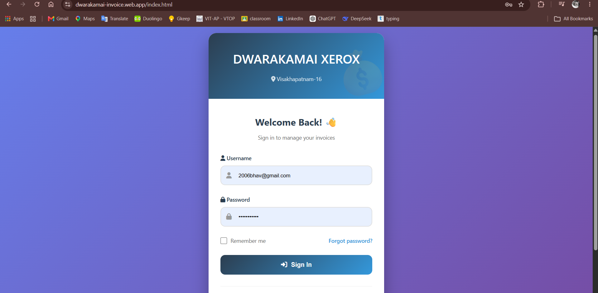
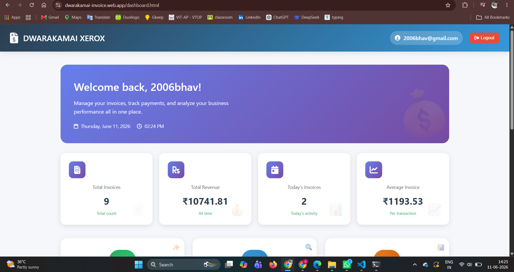
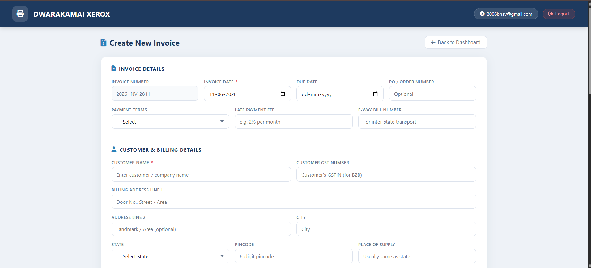
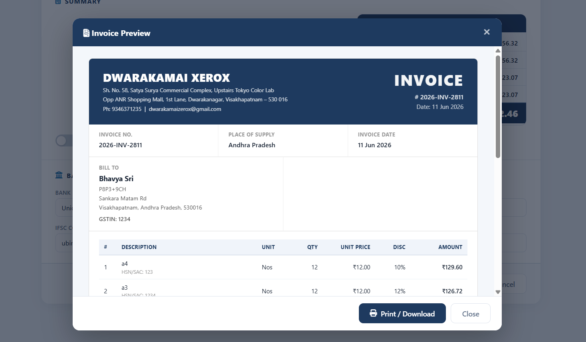
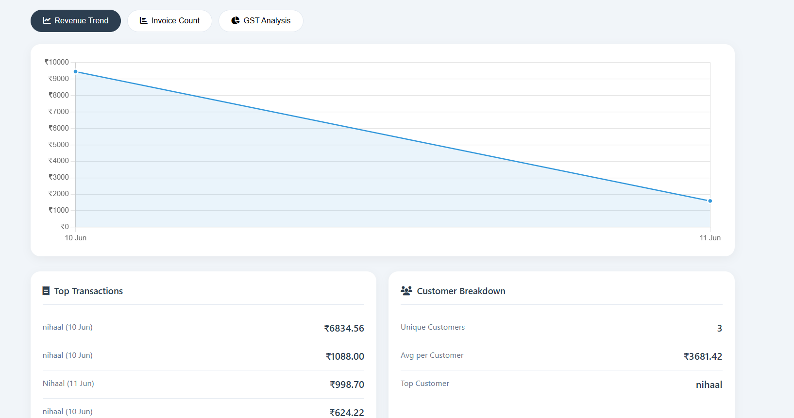
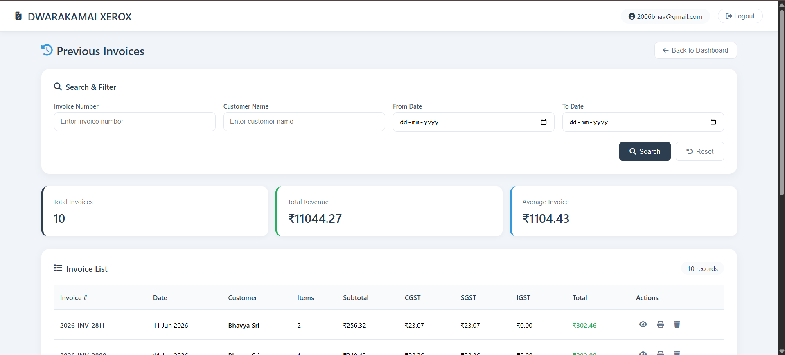

# 🧾 DWARAKAMAI XEROX — Invoice Generator  
### *Because manual billing is so last century*  

> A professional, cloud‑based invoice system for small businesses, freelancers, and anyone who wants to look super organized.

[](https://dwarakamai-invoice.web.app)  
[](https://firebase.google.com)  
[](https://developer.mozilla.org/en-US/docs/Web/JavaScript)  
[](https://opensource.org/licenses/MIT)

---

## 📸 **Sneak Peek (What it looks like)**  

| Login Page | Dashboard |
|:---:|:---:|
|  |  |

| Create Invoice | Invoice Preview |
|:---:|:---:|
|  |  |

| Statistics & Graph | Previous Records |
|:---:|:---:|
|  |  |

> 📸 *Click the links below to see more screenshots*

---

## 🎯 **What Does It Do?**

This app lets you:
- ✅ **Create beautiful invoices** with CGST/SGST/IGST support  
- ✅ **Save & sync invoices** across all your devices (yes, even your phone)  
- ✅ **Print or preview** invoices instantly  
- ✅ **Track revenue** with interactive graphs  
- ✅ **Search & filter** past invoices  
- ✅ **Login securely** with 30‑min session timeout  
- ✅ **Add items on the fly** with keyboard shortcuts (Ctrl+I = new item)  

> 🧠 *Fun fact: The "Enter" key navigation will make you feel like a spreadsheet ninja.*

---

## 🖼️ **More Screenshots (Click to View)**  

| Feature | Screenshot |
|--------|------------|
| Dashboard Page (Full) | [View Image](images/dashboard_page_2.png) |
| Create Invoice – Item Details | [View Image](images/create_invoice_2.png) |
| Create Invoice – Tax Settings | [View Image](images/create_invoice_3.png) |
| Saved Invoice View | [View Image](images/saved_invoice.png) |
| View & Print Modal | [View Image](images/view-print.png) |
| Business Statistics Dashboard | [View Image](images/business_statistics.png) |
| Login Page (Final) | [View Image](images/final_login_page.png) |
| Invoice Preview (Detailed) | [View Image](images/invoice_preview.png) |

---

## 🚀 **Live Demo**

🔗 **Try it yourself:** [https://dwarakamai-invoice.web.app](https://dwarakamai-invoice.web.app)

> *Demo credentials:*  
> 👤 Email: `owner@dwarakamai.com`  
> 🔑 Password: *contact the developer* 😉

---

## 🛠️ **Tech Stack**

| Layer | Technology |
|-------|------------|
| Frontend | HTML5, CSS3, JavaScript (ES6) |
| Backend | Firebase (Authentication + Firestore) |
| Charts | Chart.js |
| Icons | FontAwesome 6 |
| Hosting | Firebase Hosting |

---

## ✨ **Cool Features You'll Love**

- 🔁 **Real‑time sync** – Create invoice on laptop, view it on phone.
- ⌨️ **Keyboard shortcuts** – `Ctrl+S` save, `Ctrl+P` preview, `Ctrl+I` add item.
- 📊 **Dynamic graphs** – Revenue trend, invoice count, GST breakdown.
- 🧾 **GST toggle** – CGST/SGST or IGST with custom rates.
- 💰 **Amount in words** – Automatically converts total to words.
- 🖨️ **Print‑ready** – Clean print layout with dark header.
- 🔍 **Search & filter** – By invoice number, customer, or date range.

---
## 📁 Project Structure

<details>
<summary>Click to expand</summary>

```text
invoice-system/
│
├── 📄 index.html              Login Page
├── 📄 dashboard.html          Main Dashboard
├── 📄 new-record.html         Create Invoice
├── 📄 view-records.html       View & Manage Invoices
├── 📄 statistics.html         Charts & Analytics
│
├── 🎨 style.css               Global Styles
├── 🎨 invoice-style.css       Invoice Print Styles
│
├── ⚙️ script.js               Firebase & Authentication Logic
├── ⚙️ invoice-script.js       Invoice Form Logic
├── ⚙️ firebase-config.js      Firebase Configuration
│
└── 🖼️ images/                Screenshots & Assets
```

</details>


## 🧪 **Test It Yourself**

1. Clone the repo  
2. Replace `firebase-config.js` with your own Firebase project config  
3. Enable Email/Password auth in Firebase Console  
4. Run locally or deploy with `firebase deploy`

---

## 🐛 **Known Issues / Future Plans**

- [ ] Add PDF download option  
- [ ] Email invoices directly  
- [ ] Dark mode toggle  
- [ ] Multi‑currency support  
- [ ] Mobile app (PWA)

*Found a bug?* → [Open an issue](../../issues)

---

## 🙏 **Credits**

Built with ☕ and lots of `console.log()` by the **DWARAKAMAI XEROX** team.  
Special thanks to Firebase for making backend feel like magic ✨

---

## 📝 **License**

MIT © [DWARAKAMAI XEROX](https://dwarakamai-invoice.web.app)

---

### 💬 *“Finally, an invoice system that doesn't make me want to tear my hair out.”*  
— *Satisfied user (probably)*
